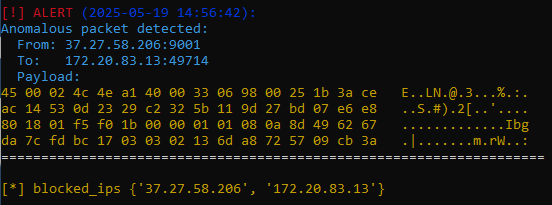

# Hybrid Intrusion Detection & Prevention  System (IDS/IPS) in Python

This project combines the functionality of an Intrusion Detection System (IDS) with an Intrusion Prevention System (IPS), written entirely in Python.

## Want to contribute?

Check out [CONTRIBUTION.md](CONTRIBUTION.md) for guidelines and setup instructions.

---

## Real-Time Packet Inspection

- Uses **Scapy** to sniff live traffic from a specified network interface.
- Extracts useful metadata per packet:
  - Total packet length
  - Time-to-Live (TTL)
  - Protocol type (TCP, UDP, etc.)
  - Size of source payload bytes

---

## Anomaly Detection (IDS)

- Powered by **Isolation Forest**, an unsupervised machine learning model.
- Trained on 200 live packets to establish a baseline of normal traffic behavior.
- Flags statistically unusual traffic patterns as potential intrusions.

---

## Automatic Intrusion Prevention (IPS)

- When an anomaly is detected:
  - Identifies the **source IP** of the offending packet.
  - Executes `iptables` to **block the IP** dynamically.
  - Ensures future traffic from the attacker is dropped.

---

## Intelligent Alerts

- Alerts include detailed context:
  - **Source IP and Port**
  - **Destination IP and Port**
  - **Timestamp**
  - **Packet Payload**, shown in:
    - **Hexadecimal**
    - **ASCII**, for human readability
- Outputs are color-coded for visibility in terminal logs.

---

## Lightweight & Extensible

- Pure Python implementation — no kernel modules.
- Easy to modify detection logic or add new defenses (e.g. email alerts, database logging).


## Demo

```bash
sudo python3 hybrid_ids.py
```


# Installation Guide: Hybrid IDS/IPS with Systemd Integration

This guide walks you through installing and running the Python-based Hybrid Intrusion Detection & Prevention System (IDS/IPS) as a Linux systemd service.

---

## Requirements

- Python 3
- `pip` with required packages (`scapy`, `pandas`, `sklearn`, `colorama`)
- Root privileges (required for packet sniffing and `iptables`)
- Linux system with `systemd` (Ubuntu, Debian, CentOS, etc.)

---

## Install Dependencies

```bash
sudo apt update
sudo apt install python3-pip iptables -y
pip3 install scapy pandas scikit-learn colorama
```

---

## Copy the Script

Assuming you have the file `hybrid_ids.py`:

```bash
sudo cp hybrid_ids.py /opt/
sudo chmod +x /opt/hybrid_ids.py
```

---

## Create systemd Service File

```bash
sudo nano /etc/systemd/system/ids-ips.service
```

Paste the following content:

```ini
[Unit]
Description=Hybrid IDS/IPS Python Service
After=network.target

[Service]
ExecStart=/usr/bin/python3 /opt/hybrid_ids.py
WorkingDirectory=/opt
Restart=on-failure
StandardOutput=journal
StandardError=journal
User=root
Group=root

[Install]
WantedBy=multi-user.target
```

Save and exit.

---

## Enable and Start the Service

```bash
sudo systemctl daemon-reexec
sudo systemctl daemon-reload
sudo systemctl enable ids-ips.service
sudo systemctl start ids-ips.service
```

---

## View Logs and Status

```bash
sudo systemctl status ids-ips.service
sudo journalctl -u ids-ips.service -f
```

---

## Stop and Disable

```bash
sudo systemctl stop ids-ips.service
sudo systemctl disable ids-ips.service
```

---

## Important Notes

- This service runs as `root` because raw socket access and firewall management (`iptables`) require elevated privileges.
- Customize the script or service file paths if needed.

## Happy hunting! 

