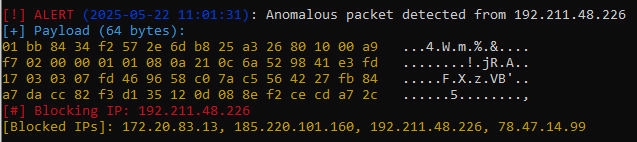

# Hybrid Intrusion Detection System (IDS) in C++

A lightweight, rule-enhanced IDS written in C++ using `libpcap`. It passively monitors network traffic, detects anomalies using basic heuristics (TTL and packet size), logs suspicious packets with timestamps, and blocks offending IPs using `iptables`.

---

## Features

- Real-time packet sniffing via `libpcap`
- Simple anomaly detection (low TTL or oversized packets)
- Automatic IP blocking using `iptables`
- Timestamped alerts
- Hex + ASCII formatted payload output
- Modular and readable code (easy to extend with ML)

---

## Requirements

- Linux (with root access)
- g++ (C++17+)
- `libpcap` development headers

Install dependencies:

```bash
sudo apt update
sudo apt install build-essential libpcap-dev
```

## Compile
```bash
make
```
## Usage

```bash
sudo ./hybrid_ids
```

## Uninstall
```bash
make clean
```
## Demo

```bash
sudo ./hybrid_ids
```

